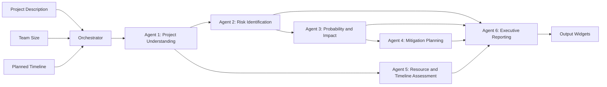
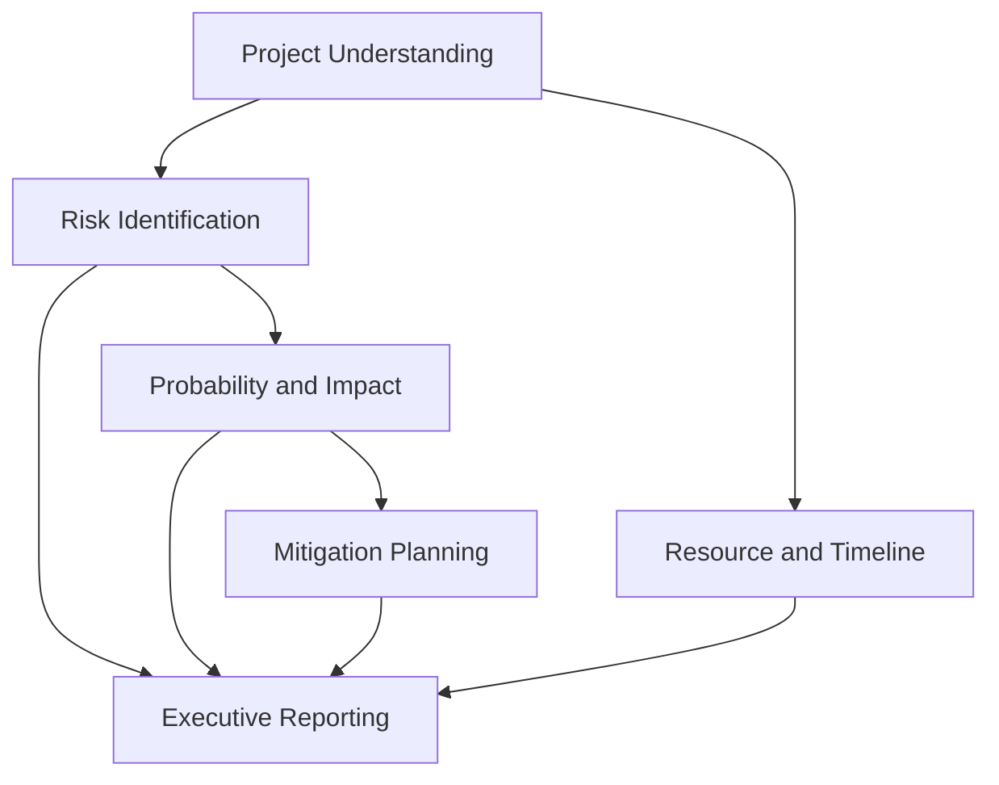
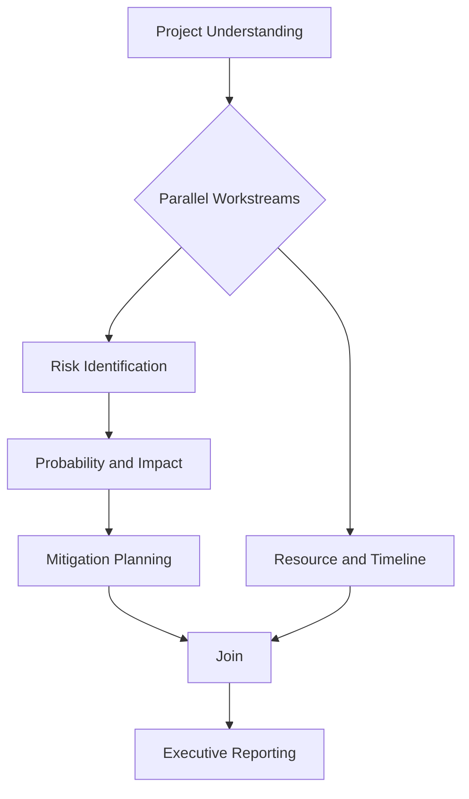
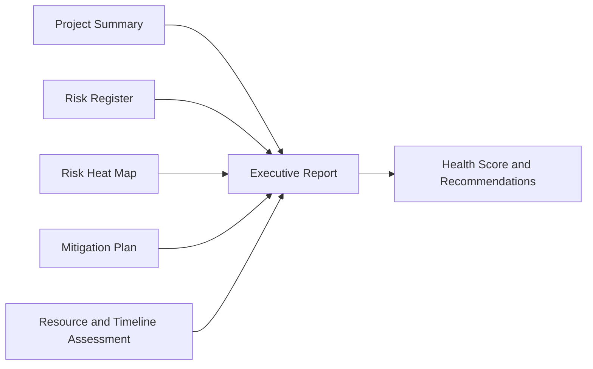
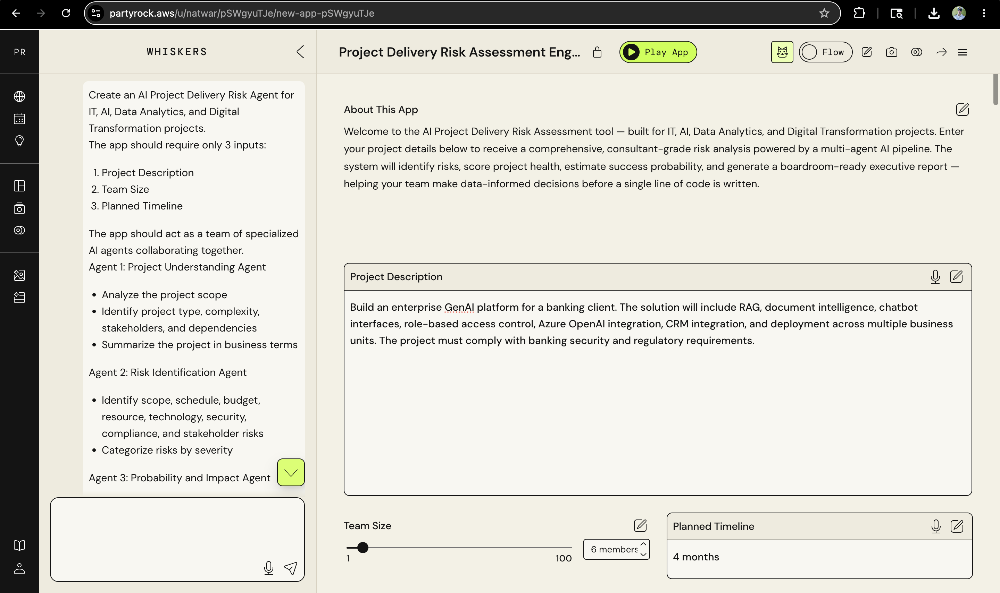
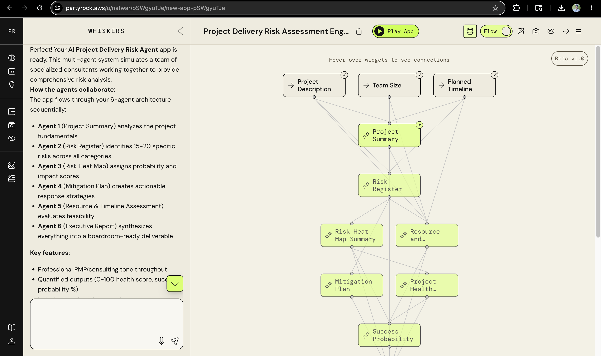
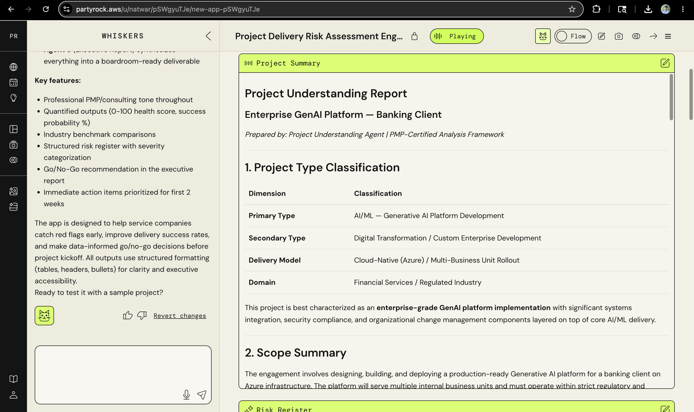
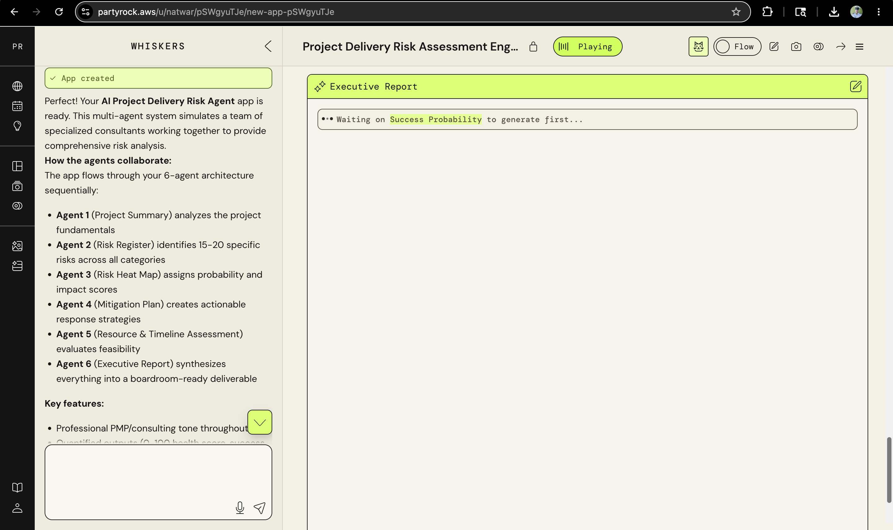
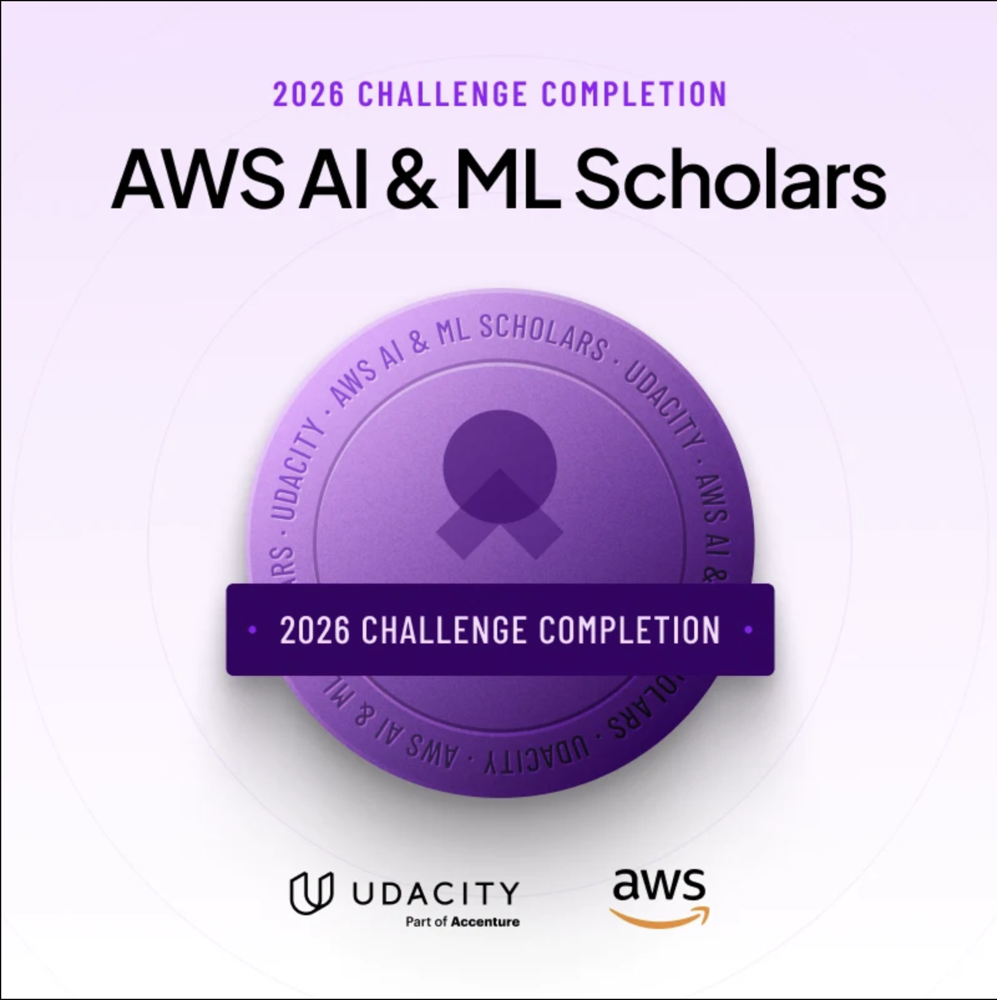

# Agentic AI Project Delivery Risk Assessment Engine

A professional, multi-agent risk assessment engine built in AWS PartyRock. This project demonstrates agentic AI principles through a structured, dependency-aware pipeline that helps delivery teams assess project risks before execution.

## Project Overview
This repository documents the Agentic AI Project Delivery Risk Assessment Engine, a multi-agent system for IT services companies, consulting firms, PMOs, delivery managers, AI teams, and project managers. The app accepts three inputs and produces a boardroom-ready risk assessment with mitigation guidance and an executive summary.

This is a learning example built with AWS PartyRock. PartyRock provides the primary app-building platform; this repo documents the architecture, outputs, and learnings.

**Inputs**
- Project Description
- Team Size
- Planned Timeline

**Key Outputs**
- Project Summary
- Risk Register
- Risk Heat Map Summary
- Project Health Score
- Success Probability
- Mitigation Plan
- Executive Report
- Recommended Next Steps

## Getting Started (AWS PartyRock)
1. Open the AWS PartyRock app link in the section below.
2. Enter the three inputs (Project Description, Team Size, Planned Timeline).
3. Review the output widgets and executive report.

**Sample Input**
- Project Description: Enterprise GenAI platform for a banking client with RAG, document intelligence, chatbot UX, RBAC, Azure OpenAI integration, and CRM integration.
- Team Size: 6
- Planned Timeline: 4 months

**What You Will Receive**
- Structured risk register with probability and impact scoring
- Risk heat map summary and project health score
- Mitigation plan with preventive and contingency actions
- Executive summary with recommendations and immediate actions

## Business Problem
Project delivery teams often commit to aggressive timelines and broad scopes without a structured, pre-execution risk assessment. This leads to avoidable delays, budget overruns, compliance gaps, and stakeholder misalignment. The goal of this system is to surface delivery risks early, quantify impact, and provide actionable mitigation strategies before execution begins.

## Why Agentic AI
- Decomposes complex delivery risk analysis into specialized, expert roles
- Enables parallel workstreams with dependency-aware orchestration
- Improves traceability and auditability of risk decisions
- Produces consistent, structured outputs for governance and executive review

## Architecture Diagram (Mermaid)

## Agent Workflow
**Agent Responsibilities**
- Agent 1: Project Understanding Agent
  - Analyze project scope
  - Identify complexity, stakeholders, and dependencies
  - Generate a business summary
- Agent 2: Risk Identification Agent
  - Identify scope, schedule, resource, technology, security, compliance, and stakeholder risks
  - Categorize risks by severity
- Agent 3: Probability and Impact Agent
  - Assign probability and business impact
  - Provide reasoning for scoring
- Agent 4: Mitigation Planning Agent
  - Generate mitigation actions and contingency plans
  - Recommend preventive measures
- Agent 5: Resource and Timeline Assessment Agent
  - Evaluate feasibility of team size and timeline
  - Detect bottlenecks and capacity gaps
- Agent 6: Executive Reporting Agent
  - Produce executive summary, health score, success probability, and recommendations

**Agent Dependency Graph (Mermaid)**

**Parallel Execution Flow (Mermaid)**

**Executive Report Generation Pipeline (Mermaid)**

## Screenshots

Input form for project description, team size, and planned timeline.

Agent workflow and widget dependency visualization in PartyRock.

Project understanding report generated by the Project Understanding Agent.

Executive report widget synthesizing results into a boardroom-ready summary.

AWS AI and ML Scholars challenge completion badge.

## Project Structure
- assets/images: UI screenshots used in this README
- assets/certificates: Certificate and credentials
- assets/source: Source materials referenced in documentation
- docs: Architecture and usage documentation

## Results (Sample)
Example outcomes from a regulated banking GenAI platform case study:
- 30-item risk register across scope, schedule, resource, technology, security, compliance, and stakeholder categories
- Project health score: 15/100 (critical)
- Success probability: 18%
- Clear executive recommendations and immediate action items for Weeks 1 to 2

## Future Improvements
- Monte Carlo delivery simulations and cost variance modeling
- Integration with Jira, Azure DevOps, and ServiceNow for risk tracking
- Exportable risk register to CSV and PDF
- Customizable risk taxonomies by industry and region
- Role-based governance dashboards

## Learning Outcomes
- Designing dependency-aware agent orchestration
- Applying structured risk management frameworks with AI
- Producing executive-grade reporting from agent outputs
- Balancing parallel execution with accountability and traceability

## AWS PartyRock Link
AWS PartyRock App: https://partyrock.aws/u/your-handle/your-app

## Certificate
Udacity Certificate: [assets/certificates/udacity-certificate.pdf](assets/certificates/udacity-certificate.pdf)

## Source Materials
Project Document: [assets/source/project-delivery-risk-assessment-engine.docx](assets/source/project-delivery-risk-assessment-engine.docx)

## Documentation
- [docs/architecture.md](docs/architecture.md)
- [docs/how-it-works.md](docs/how-it-works.md)
- [docs/use-cases.md](docs/use-cases.md)
- [docs/future-enhancements.md](docs/future-enhancements.md)

## Author
Natwar Upadhyay

## License
MIT. See [LICENSE](LICENSE).
