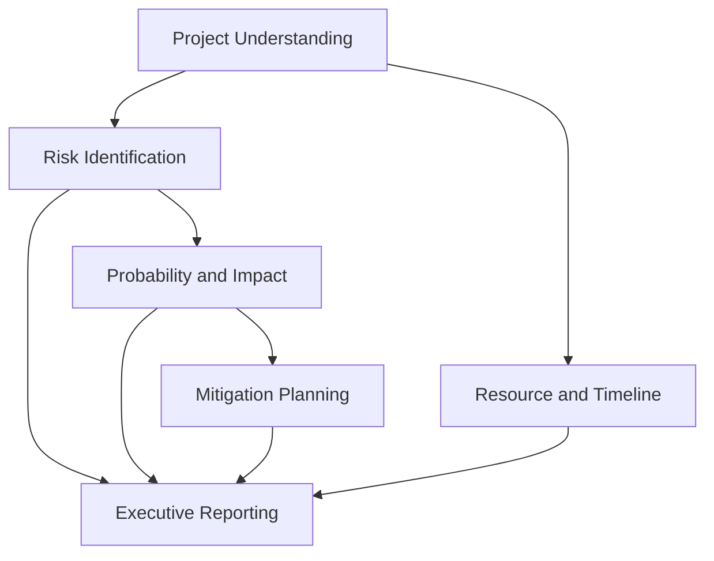
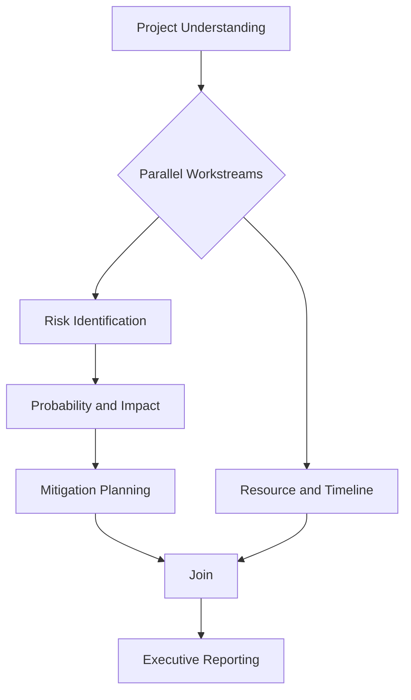
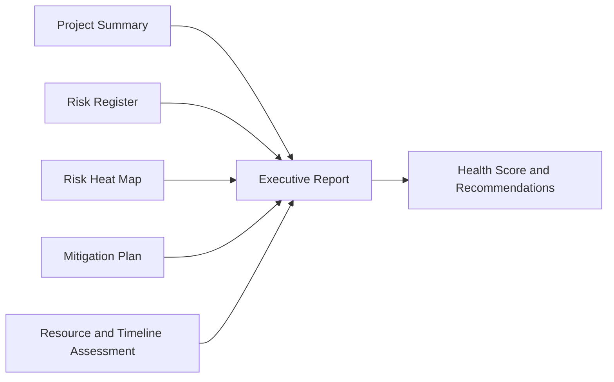

# Architecture

## Overview
The Agentic AI Project Delivery Risk Assessment Engine is a multi-agent system built in AWS PartyRock. It uses a dependency-aware orchestrator to route inputs through specialized agents that collaborate to produce risk analysis, mitigation guidance, and executive reporting.

## Core Components
- Input Layer: Project Description, Team Size, Planned Timeline
- Orchestrator: Dependency-aware routing and aggregation
- Agent Layer: Six specialized agents with clear responsibilities
- Output Layer: Structured widgets and executive report

## Agent Responsibilities
- Agent 1: Project Understanding
  - Classify project type, scope, stakeholders, and dependencies
  - Produce a business summary
- Agent 2: Risk Identification
  - Identify risks across scope, schedule, resource, technology, security, compliance, and stakeholder domains
- Agent 3: Probability and Impact
  - Assign probability and business impact scores
  - Provide reasoning for each risk score
- Agent 4: Mitigation Planning
  - Define mitigation actions, contingency plans, and preventive measures
- Agent 5: Resource and Timeline Assessment
  - Assess feasibility, capacity, and bottlenecks
- Agent 6: Executive Reporting
  - Synthesize a boardroom-ready report with recommendations

## Dependency Graph

## Parallel Execution

## Executive Report Pipeline

## Output Widgets
- Project Summary
- Risk Register
- Risk Heat Map Summary
- Project Health Score
- Success Probability
- Mitigation Plan
- Executive Report
- Recommended Next Steps

## Design Principles
- Dependency-based execution
- Parallel task execution where safe and traceable
- Structured, audit-friendly outputs
- Professional tone aligned to project governance standards
